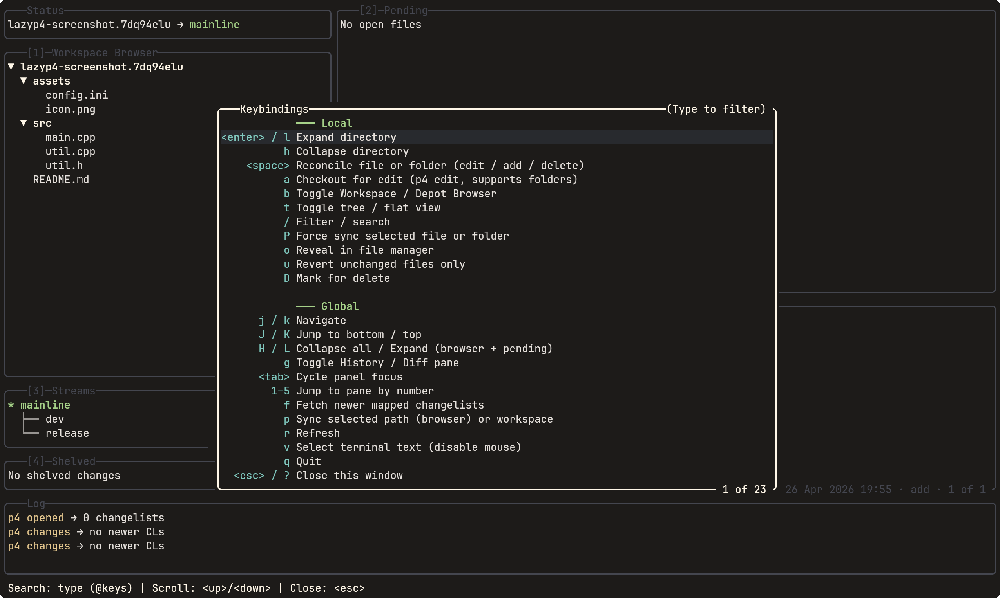

# lazyp4

A terminal UI for [Perforce P4](https://www.perforce.com/products/helix-core), inspired by [lazygit](https://github.com/jesseduffield/lazygit).



## Requirements

- `p4` CLI installed and in `$PATH`
- A configured Perforce workspace (`P4PORT`, `P4USER`, `P4CLIENT`, a P4CONFIG file, or the lazyp4 config file)
- Go 1.25+ when installing with Go or building from source

## Installation

Download the release archive for your OS and architecture from [GitHub Releases](https://github.com/Solessfir/lazyp4/releases). Extract `lazyp4` (`lazyp4.exe` on Windows) and place it in a directory on `PATH`.

On Windows, once the package is available in WinGet:

```powershell
winget install --exact --id Solessfir.lazyp4
```

Or install with Go:

```bash
go install github.com/solessfir/lazyp4/cmd/lazyp4@latest
```

The executable is installed in `GOBIN`, or `GOPATH/bin` when `GOBIN` is unset. Add that directory to `PATH`.

Or build the current `main` branch from source:

```bash
git clone https://github.com/solessfir/lazyp4
cd lazyp4
go build -o lazyp4 ./cmd/lazyp4
```

## Configuration

Connection settings are resolved in this order (highest priority first):

1. **P4CONFIG files** - native Perforce lookup includes ancestor inheritance and uses the first occurrence of duplicate settings
2. **Native Perforce settings** - effective `P4PORT`, `P4USER`, and `P4CLIENT` from `p4 set`, including environment variables, P4ENVIRO, and platform registry settings
3. **lazyp4.toml** - platform config file (lowest priority)

With `env_over_toml = false`, explicit TOML values take precedence over native settings outside P4CONFIG; native settings still fill empty fields. P4CONFIG always takes priority.

Config file location:

| Platform | Path |
|----------|------|
| Linux    | `~/.config/lazyp4/lazyp4.toml` |
| macOS    | `~/Library/Application Support/lazyp4/lazyp4.toml` |
| Windows  | `<lazyp4.exe directory>/lazyp4.toml` |

All fields are optional:

```toml
[p4]
port         = "ssl:your-server:1666"  # Perforce server address
user         = "youruser"              # Perforce username
client       = "your-workspace"        # Workspace (client) name
env_over_toml = true                   # Native settings win over TOML; P4CONFIG always wins

[auth]
store_password = false           # Opt in to password reads/writes in the system keyring

[ui]
fetch_interval    = "10m"        # Background refresh interval (empty = disabled)
pending_tree_view = true         # Start pending pane in tree view (false = flat list)

[linux]
file_manager = ""                # File manager for `o` key (e.g. "nemo"). Auto-detected if empty.
```

Password storage is disabled by default. When enabled, credentials are stored separately for each effective server and user. Existing Perforce login tickets work with either setting.

lazyp4 verifies the connection before requesting a password and never accepts an unknown SSL fingerprint automatically. Verify the fingerprint with your Perforce administrator, then register it with `p4 -p ssl:your-server:1666 trust -i <verified-fingerprint>` before launching lazyp4.

## Keybindings

Press `?` inside the app for context-sensitive help.

Type to fuzzy-search descriptions, or start with `@` to search keys. Use arrow keys, Page Up/Down, Home, and End to scroll. Escape clears a filter first, then closes help; Ctrl+C or Enter closes it immediately.

### Global

| Key | Action |
|-----|--------|
| `j` / `k` | Navigate down / up |
| `Tab` | Cycle pane focus |
| `1` - `5` | Jump to pane by number |
| `Esc` | Back to browser pane |
| `g` | Toggle history / diff pane |
| `f` | Fetch - count mapped CLs newer than the highest have CL |
| `p` | Sync selected path (browser pane) or entire workspace (other panes) |
| `r` | Refresh |
| `c` | Cancel current operation |
| `v` | Visual mode (disables mouse for text selection) |
| `?` | Keybindings help |
| `q` | Quit |

### Browser pane

| Key | Action |
|-----|--------|
| `Enter` / `l` | Expand directory |
| `h` | Collapse directory |
| `b` | Toggle Workspace / Depot Browser |
| `t` | Toggle tree / flat view |
| `/` | Filter / search |
| `Space` | Reconcile file or folder (edit / add / delete) |
| `a` | Checkout for edit - works on files and folders (recursive) |
| `d` | Discard (revert) checked-out file |
| `u` | Revert unchanged files only (skips files with local changes) |
| `o` | Reveal in file manager |
| `P` | Force sync selected file or folder |
| `D` | Mark for delete |

### Pending pane

| Key | Action |
|-----|--------|
| `Space` | Mark / unmark file for partial submit |
| `Enter` | Open file |
| `o` | Reveal in file manager |
| `l` / `h` | Expand / collapse folder |
| `s` | Submit - opens description prompt; uses marked files if any |
| `e` / `E` | Shelve selected or marked files into a new CL, with revert / without revert |
| `m` | Move file(s) to a different CL |
| `d` | Discard selected file, marked files, or CL files; skips confirmation if a single file is unchanged; `dd` also deletes local added files |
| `u` | Revert unchanged files only - works on selected file, marked files, or entire CL |
| `R` | Show conflicts (scoped to file or folder) |
| `t` | Toggle tree / flat view |
| `/` | Filter / search |

In discard confirmation, use `j` / `k` or arrow keys to choose, `Enter` to execute, and `Esc` to cancel. `x` reverts the confirmed files; `d` also deletes local files opened for add when that option is available.

### Streams pane

| Key | Action |
|-----|--------|
| `Enter` / `l` | Switch workspace to selected stream |
| `i` | Integrate - pull from parent (`m`) or push to parent (`c`) |

Pull selects a child stream and merges its parent into the current child workspace. Promotion selects the source child while using a workspace for its parent, then stages a copy from child to parent. The app checks the workspace direction before running either operation.

### Shelved pane

| Key | Action |
|-----|--------|
| `u` | Unshelve + delete shelf |
| `d` | Delete shelf |

Unshelve deletes the shelf only after every shelved file is confirmed restored. Failed or partial unshelves retain the complete shelf. Cross-stream unshelves using `-S` retain the source shelf because remapped file identities cannot be verified automatically.

### Conflicts pane

| Key | Action |
|-----|--------|
| `Enter` | Interactive `p4 resolve` for the selected conflict, honoring effective `P4MERGE` |
| `a` | Automatic merge (`-am`) of displayed scoped conflicts |
| `t` | Accept theirs (`-at`), after confirmation |
| `y` | Accept yours (`-ay`), after confirmation |
| `s` | Safe automatic resolve (`-as`) of displayed scoped conflicts |
| `Esc` | Close conflicts pane |

### History / Log pane

| Key | Action |
|-----|--------|
| `Space` / `Enter` | Checkout workspace to selected CL |

## Development

```bash
go test ./...
go vet ./...
```

Native configuration tests run when `p4` is in PATH. Set `LAZYP4_TEST_P4D` to a `p4d` executable to also run server integration tests against temporary loopback servers and workspaces.

## License

Licensed under the [MIT License](LICENSE).
