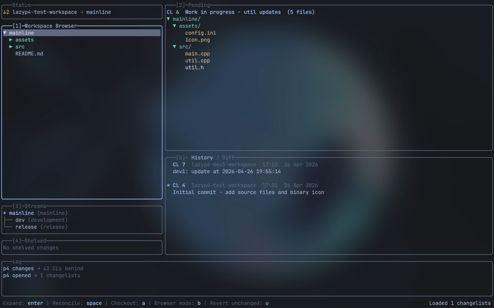

# lazyp4

A lazygit-inspired terminal UI for Perforce (p4).



> [!WARNING]
> **Use at your own risk.** This project was built with agentic AI coding (Claude). I use lazyp4 in a production environment daily without issues, but I take no responsibility if it wipes your depot, destroys local data, or causes any other damage.

## Features

- Browse open changelists and files in tree or flat view
- Color-coded file status - yellow = modified, default = checked out unchanged, green = added, red = deleted
- Colorized unified diff viewer
- File revision history
- Mark individual files for partial submit
- Shelve and unshelve changelists (including cross-stream via `-S`)
- Stream depot support - stream browser, stream switching, merge/copy integration
- Fetch (dry-run sync) - see how many CLs are pending before committing to a sync
- Reconcile offline changes (`p4 reconcile` + `p4 edit` fallback)
- Discard added files with optional local delete (`dd`)
- Skip discard confirmation for files with no local changes
- Conflict resolution - interactive Perforce merge tools, automatic merging, safe resolve, and confirmed accept theirs/yours
- `[?]` indicator on files needing resolve
- Mouse support - click to focus panes and select files
- Keyboard-driven with lazygit-style numbered pane shortcuts
- Context-sensitive hotkey bar
- Animated action status in the footer, with progress counts and cancellation for sync and submit

During actions and background loads, the footer shows the action name with animated dots, such as `Checking out ●∙∙`. The indicator stays active while work is running, including while dialogs are open, and disappears when the work finishes or fails. Sync and submit also show file progress and a `c - cancel` hint when cancellation is available.

The UI follows the terminal's default text and background colors, with ANSI colors for actions and file status. Inactive borders and selected rows use subtle neutral dark shades, following lazygit's styling. Terminal transparency remains controlled by the terminal itself.

## Requirements

- Go 1.25+
- `p4` CLI installed and in `$PATH`
- A configured Perforce workspace (`P4PORT`, `P4USER`, `P4CLIENT`, a P4CONFIG file, or the lazyp4 config file)

## Installation

Download the latest binary from [releases](https://github.com/Solessfir/lazyp4/releases).

Or build from source:

```bash
git clone https://github.com/solessfir/lazyp4
cd lazyp4
go build -o lazyp4 ./cmd/main.go
```

## Configuration

Connection settings are resolved in this order (highest priority first):

1. **P4CONFIG files** - native Perforce lookup includes ancestor inheritance and uses the first occurrence of duplicate settings
2. **Native Perforce settings** - effective `P4PORT`, `P4USER`, and `P4CLIENT` from `p4 set`, including environment variables, P4ENVIRO, and platform registry settings
3. **lazyp4.toml** - platform config file (lowest priority)

With `env_over_toml = false`, explicit TOML values take precedence over native settings outside P4CONFIG; native settings still fill empty fields. P4CONFIG always takes priority.

Config file location:

| Platform | Path |
|----------|------|
| Linux    | `~/.config/lazyp4/lazyp4.toml` |
| macOS    | `~/Library/Application Support/lazyp4/lazyp4.toml` |
| Windows  | `<lazyp4.exe directory>/lazyp4.toml` |

All fields are optional:

```toml
[p4]
port         = "ssl:your-server:1666"  # Perforce server address
user         = "youruser"              # Perforce username
client       = "your-workspace"        # Workspace (client) name
env_over_toml = true                   # Native settings win over TOML; P4CONFIG always wins

[auth]
store_password = false           # Opt in to password reads/writes in the system keyring

[ui]
fetch_interval    = "10m"        # Background refresh interval (empty = disabled)
pending_tree_view = true         # Start pending pane in tree view (false = flat list)

[linux]
file_manager = ""                # File manager for `o` key (e.g. "nemo"). Auto-detected if empty.
```

Password storage is disabled by default. When enabled, credentials are stored separately for each effective server and user. Existing Perforce login tickets work with either setting.

lazyp4 verifies the connection before requesting a password and never accepts an unknown SSL fingerprint automatically. Verify the fingerprint with your Perforce administrator, then register it with `p4 -p ssl:your-server:1666 trust -i <verified-fingerprint>` before launching lazyp4.

## Keybindings

Press `?` inside the app for context-sensitive help.

### Global

| Key | Action |
|-----|--------|
| `j` / `k` | Navigate up / down |
| `tab` | Cycle pane focus |
| `1` - `5` | Jump to pane by number |
| `esc` | Back to browser pane |
| `g` | Toggle history / diff pane |
| `f` | Fetch - dry-run sync, shows pending file count |
| `p` | Sync selected path (browser pane) or entire workspace (other panes) |
| `r` | Refresh |
| `c` | Cancel current operation |
| `v` | Visual mode (disables mouse for text selection) |
| `?` | Keybindings help |
| `q` | Quit |

### Browser pane

| Key | Action |
|-----|--------|
| `enter` / `l` | Expand directory |
| `h` | Collapse directory |
| `b` | Toggle Workspace / Depot Browser |
| `t` | Toggle tree / flat view |
| `/` | Filter / search |
| `space` | Reconcile file or folder (edit / add / delete) |
| `a` | Checkout for edit - works on files and folders (recursive) |
| `d` | Discard (revert) checked-out file |
| `u` | Revert unchanged files only (skips files with local changes) |
| `o` | Reveal in file manager |
| `P` | Force sync selected file or folder only (contrast: `p` syncs entire workspace) |
| `D` | Mark for delete |

### Pending pane

| Key | Action |
|-----|--------|
| `space` | Mark / unmark file for partial submit |
| `enter` | Open file |
| `o` | Reveal in file manager |
| `l` / `h` | Expand / collapse folder |
| `s` | Submit - opens description prompt; uses marked files if any |
| `e` / `E` | Shelve selected or marked files into a new CL, with revert / without revert |
| `m` | Move file(s) to a different CL |
| `d` | Discard selected file, marked files, or CL files; skips confirmation if a single file is unchanged; `dd` also deletes local added files |
| `u` | Revert unchanged files only - works on selected file, marked files, or entire CL |
| `R` | Show conflicts (scoped to file or folder) |
| `t` | Toggle tree / flat view |
| `/` | Filter / search |

### Streams pane

| Key | Action |
|-----|--------|
| `enter` / `l` | Switch workspace to selected stream |
| `i` | Integrate - pull from parent (`m`) or push to parent (`c`) |

Pull selects a child stream and merges its parent into the current child workspace. Promotion selects the source child while using a workspace for its parent, then stages a copy from child to parent. The app checks the workspace direction before running either operation.

Streams appear as a compact hierarchy with `*` marking the workspace's current stream. The selected stream's type and position appear in the footer when space permits. Long names are shortened to fit, and the list scrolls to keep the selection visible.

### Shelved pane

| Key | Action |
|-----|--------|
| `u` | Unshelve + delete shelf |
| `d` | Delete shelf |

Unshelve deletes the shelf only after every shelved file is confirmed restored. Failed or partial unshelves retain the complete shelf. Cross-stream unshelves using `-S` retain the source shelf because remapped file identities cannot be verified automatically.

### Conflicts pane

| Key | Action |
|-----|--------|
| `enter` | Interactive `p4 resolve` for the selected conflict, honoring effective `P4MERGE` |
| `a` | Automatic merge (`-am`) of displayed scoped conflicts |
| `t` | Accept theirs (`-at`), after confirmation |
| `y` | Accept yours (`-ay`), after confirmation |
| `s` | Safe automatic resolve (`-as`) of displayed scoped conflicts |
| `esc` | Close conflicts pane |

### History / Log pane

| Key | Action |
|-----|--------|
| `space` / `enter` | Checkout workspace to selected CL |

## Development checks

Run `go test ./...` and `go vet ./...`. Native configuration tests run when `p4` is in PATH. Set `LAZYP4_TEST_P4D` to a `p4d` executable to also run server integration tests against temporary loopback servers and workspaces. CI runs these separately from the platform test matrix.
